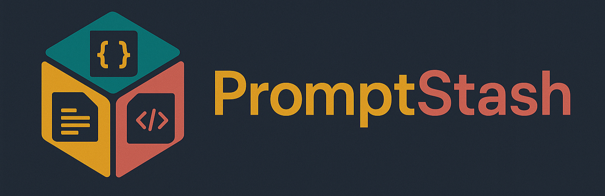

# promptstash

<div style="display: flex; justify-content: center; align-items: center; width: 100%;">
  
</div>


A free, open-source collection of generic, reusable developer prompts for various workflows.

## Overview

Promptstash offers prompts designed to help developers automate, debug, and streamline their work. Prompts are generic and reusable—copy, adapt, or integrate them into your favorite AI tools or applications. Prompts work with any AI assistant, with a focus on getting the most from standard copilots.

## Getting Started

### Installation

Install PromptStash with a single command:

```bash
curl -fsSL https://raw.githubusercontent.com/korotkevics/promptstash/main/install.sh | bash
```

Or if you don't have `curl`:

```bash
wget -qO- https://raw.githubusercontent.com/korotkevics/promptstash/main/install.sh | bash
```

For detailed installation options, updating, manual installation, and uninstalling instructions, see the [Installation Guide](docs/installation.md).

### Using Prompts

Prompts can be used directly in your chat tool or programmatically:

**Example 1: Basic Usage**

```text
Follow the instructions in the prompt at $PROMPTSTASH_DIR/commit.md.
```

**Example 2: With Additional Context**

```text
Follow the instructions in the prompt at $PROMPTSTASH_DIR/debug.md to investigate the stacktrace below:
...
```

## 📊 Benchmarks

Token counts by version (latest 5):

| Prompt | **0.12.0** | **0.12.0** | **0.11.0** | **0.9.3** | **0.9.2** |
|---|---|---|---|---|---|
| **bump-semver-version** | 864 | 864 | 864 | - | - |
| **commit** | 286 | 286 | 286 | 286 | 286 |
| **create-pr** | 490 | 490 | 490 | 490 | 490 |
| **create-simple-source-map** | 706 | 706 <sub>🔴 +72</sub> | 634 | 634 | 634 |
| **debug** | 317 | 317 | 317 | 317 | 317 |
| **fix-pr** | 580 | 580 | 580 | 580 | 580 |
| **improve-prompt** | 416 | 416 | 416 | 416 | 416 |
| **optimize-prompt** | 1186 | 1186 | 1186 | 1186 | 1186 |
| **read-source-map** | 317 | 317 <sub>🔴 +67</sub> | 250 | 250 | 250 |
| **review-pr** | 625 | 625 | 625 | 625 | 625 |
| **ship** | 202 | 202 | 202 | 202 | 202 |
| **squash** | 180 | 180 | 180 | 180 | 180 |
| **TOTAL** | **6169** | **6169** <sub>🔴 +139</sub> | **6030** <sub>🔴 +864</sub> | **5166** | **5166** |


## 🔗 Prompt Reference Graph

Visual representation of how prompts reference each other:

<div style="display: flex; justify-content: center; align-items: center; width: 100%;">
  
</div>

Prompts are represented as circles with arrows showing references. Island nodes (like `commit` and `squash`) have no outbound references, while others form a reference network.

## Contributing

We welcome contributions! See [CONTRIBUTING.md](CONTRIBUTING.md) for guidelines on how to add or improve prompts.
