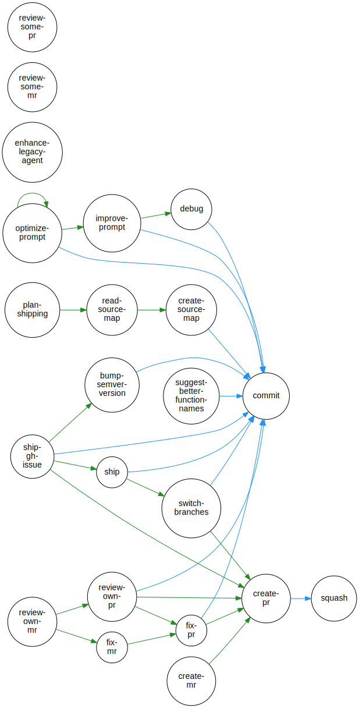

# promptstash

<div style="display: flex; justify-content: center; align-items: center; width: 100%;">
  
</div>


A free, open-source collection of generic, reusable developer prompts for various workflows.

## Overview

Promptstash offers prompts designed to help developers automate, debug, and streamline their work. Prompts are generic and reusable—copy, adapt, or integrate them into your favorite AI tools or applications. Prompts work with any AI assistant, with a focus on getting the most from standard copilots.

## Getting Started

### Installation

Install PromptStash with a single command:

```bash
curl -fsSL https://raw.githubusercontent.com/korotkevics/promptstash/main/install.sh | bash
```

Or if you don't have `curl`:

```bash
wget -qO- https://raw.githubusercontent.com/korotkevics/promptstash/main/install.sh | bash
```

For detailed installation options, updating, manual installation, and uninstalling instructions, see the [Installation Guide](docs/installation.md).

### CLI Commands

PromptStash includes a CLI with commands to list and pick prompts:

```bash
promptstash list              # List all available prompts
promptstash pick name         # Pick a prompt and copy its filename
promptstash pick content      # Pick a prompt and copy its contents
promptstash pick path         # Pick a prompt and copy its path
```

For complete CLI documentation, see the [CLI Usage Guide](docs/cli-usage.md).

### Using Prompts

PromptStash prompts are stored in `$PROMPTSTASH_DIR/.promptstash/`. When working with your AI assistant, reference these prompts by their full path so the assistant can load and follow the instructions.

> **Tip:** If your AI assistant supports context memory well, you can first ask it to remember this path: `Load prompts in $PROMPTSTASH_DIR/.promptstash/ and remember to search there when I ask you to follow an *.md prompt.` This allows you to reference prompts more simply, like `follow commit.md` instead of using the full path each time.

Here are practical examples:

**Example 1: Creating a well-formatted commit**

```text
Load the prompt at $PROMPTSTASH_DIR/.promptstash/commit.md and follow its instructions to create a commit message.
```

**Example 2: Getting a PR reviewed**

```text
Follow the instructions in $PROMPTSTASH_DIR/.promptstash/review-own-pr.md to analyze my current PR and provide feedback.
```

**Example 3: Debugging an issue with context**

```text
Load $PROMPTSTASH_DIR/.promptstash/debug.md and help me investigate this error:
[paste your error message or stack trace here]
```

## 📊 Benchmarks

Token counts by version (latest 5):

| Prompt | Cost | Entropy | **0.33.0** | **0.33.0** | **0.32.1** | **0.31.4** | **0.31.3** |
|---|---|---|---|---|---|---|---|
| **bump-semver-version** | $$$ | 7.33 | 422 | 422 | 422 | 422 | 422 |
| **commit** | $$ | 6.99 | 365 | 365 | 365 | 365 | 365 |
| **create-mr** | $$ | 6.93 | 272 | 272 | 272 | 272 | 272 |
| **create-pr** | $$$ | 7.18 | 403 | 403 | 403 | 403 | 403 |
| **create-source-map** | $$ | 7.06 | 332 | 332 | 332 | 332 | 332 |
| **debug** | $$ | 6.95 | 340 | 340 | 340 | 340 | 340 |
| **enhance-legacy-agent** | $$ | 6.52 | 327 | 327 | 327 | 327 | 327 |
| **fix-mr** | $ | 6.53 | 179 | 179 | 179 | 179 | 179 |
| **fix-pr** | $$ | 7.14 | 340 | 340 | 340 | 340 <sub>🔴 +80</sub> | 260 |
| **improve-prompt** | $$ | 6.88 | 366 | 366 | 366 | 366 | 366 |
| **optimize-prompt** | $$$$$$$ | 7.99 | 1276 | 1276 | 1276 <sub>🔴 +2</sub> | 1274 | 1274 |
| **plan-shipping** | $$ | 6.53 | 371 | 371 | 371 | 371 | 371 |
| **read-source-map** | $$ | 7.04 | 306 | 306 | 306 | 306 | 306 |
| **review-mr** |  | - | - | - | 228 | 228 | 228 |
| **review-own-mr** | $$ | 6.68 | 232 | 232 | - | - | - |
| **review-own-pr** | $$$ | 7.67 | 568 | 568 | - | - | - |
| **review-pr** |  | - | - | - | 568 | 568 | 568 |
| **review-some-mr** | $$ | 6.94 | 331 | 331 | - | - | - |
| **review-some-pr** | $$ | 6.91 | 319 | 319 | - | - | - |
| **ship-gh-issue** | $$$ | 7.35 | 528 | 528 | 528 | 528 | 528 |
| **ship** | $$ | 6.69 | 258 | 258 | 258 | 258 | 258 |
| **squash** | $ | 6.55 | 180 | 180 | 180 | 180 | 180 |
| **suggest-better-function-names** | $$ | 6.92 | 303 | 303 | 303 | 303 | 303 |
| **switch-branches** | $$$$ | 7.53 | 658 | 658 | 658 | 658 <sub>🔴 +81</sub> | 577 |
| **TOTAL** |  |  | **8676** | **8676** <sub>🔴 +654</sub> | **8022** <sub>🔴 +2</sub> | **8020** <sub>🔴 +161</sub> | **7859** |


## Prompt Reference Graph

Visual representation of how prompts reference each other:

<div style="display: flex; justify-content: center; align-items: center; width: 100%;">
  
</div>

Prompts are represented as circles with arrows showing references. Island nodes (like `commit` and `squash`) have no outbound references, while others form a reference network.

**Color Legend:**
- <span style="color: #228B22; font-weight: bold;">Green arrows</span>: Outbound references to non-terminal nodes (nodes that also reference other prompts)
- <span style="color: #1E90FF; font-weight: bold;">Blue arrows</span>: Inbound references to terminal nodes (utility nodes like 'commit' and 'squash' that don't reference others)

## Contributing

We welcome contributions! See [CONTRIBUTING.md](CONTRIBUTING.md) for guidelines on how to add or improve prompts.
